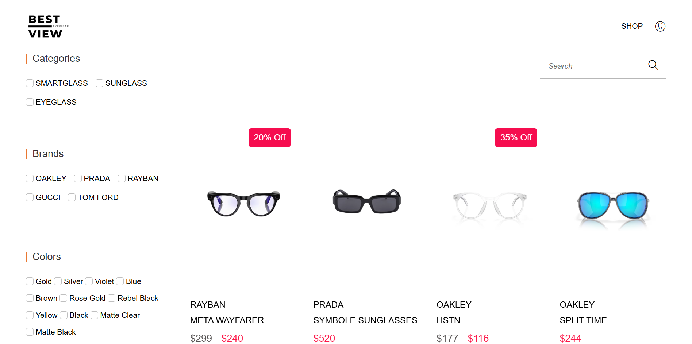

# 🛒 BestView - Ecommerce Platform

<div align="center">

[](https://github.com/hamrazhakeem/bestview-ecommerce)

[](https://developer.mozilla.org/en-US/docs/Web/HTML)
[](https://www.djangoproject.com/)
[](https://www.postgresql.org/)
[](https://www.djangoproject.com/)
[](https://www.docker.com/)

</div>

## 📸 Project Screenshots

<div align="center" style="display: flex; justify-content: space-between;">
  
  
</div>

## 🎯 About BestView

BestView is a comprehensive ecommerce platform sells spectacles built with Django, offering a seamless shopping experience with secure payment processing, responsive design, and robust product management capabilities.

### 🌟 Key Features

- **Product Management**
  - Category and brand organization
  - Product variants with color options
  - Inventory tracking system
  - Image gallery for products

- **Promotional Features**
  - Coupon system with validation
  - Category-based offers
  - Product-specific discounts

- **User Experience**
  - Responsive design for all devices
  - Intuitive product browsing and filtering
  - User account management
  - Order history and tracking

- **Secure Checkout**
  - PayPal integration for payments
  - Order processing and management
  - Address management
  - Cart functionality

- **Admin Dashboard**
  - Sales analytics and reporting
  - Product management
  - User management
  - Order processing
  
## 🚀 Getting Started

### Prerequisites
- Python 3.10+
- PostgreSQL
- Docker and Docker Compose (for containerized setup)

### Installation & Setup

#### Option 1: Traditional Setup

1. Clone the repository:

```bash
git clone https://github.com/hamrazhakeem/bestview-ecommerce.git
cd bestview-ecommerce
```

2. Create a .env file with required environment variables:
```env
SECRET_KEY=your_secret_key
DEBUG=True

DATABASE_NAME=your_db_name
DATABASE_USER=your_db_user
DATABASE_PASSWORD=your_db_password
DATABASE_HOST=your_db_host
DATABASE_PORT=your_db_port

EMAIL_HOST_USER=your_email
EMAIL_HOST_PASSWORD=your_email_password

PAYPAL_CLIENT_ID=your_paypal_client_id
```

3. Install dependencies:
```bash
pip install -r requirements.txt
```

4. Run migrations:
```bash
python manage.py migrate
```

5. Start the development server:
```bash
python manage.py runserver
```

#### Option 2: Docker Setup

1. Clone the repository:
```bash
git clone https://github.com/hamrazhakeem/bestview-ecommerce.git
cd bestview-ecommerce
```

2. Start the application using Docker Compose:
```bash
docker-compose up --build
```

3. Run migrations in the Docker container:
```bash
docker-compose exec web python manage.py migrate
```

4. Create a superuser (optional):
```bash
docker-compose exec web python manage.py createsuperuser
```

5. Access the application at http://localhost:8000

## 🔧 Tech Stack

- **Frontend**
  - HTML5/CSS3
  - JavaScript
  - Bootstrap

- **Backend**
  - Django
  - PostgreSQL
  - PayPal API Integration

- **Infrastructure**
  - NGINX
  - AWS EC2
  - Docker & Docker Compose
  
- **DevOps**
  - GitHub Actions for CI/CD
  - Automated testing and deployment
  - Docker Hub for container registry

## 🚀 CI/CD Pipeline

BestView implements a robust CI/CD pipeline using GitHub Actions that automates the build, test, and deployment process:

- **Continuous Integration**
  - Automatic building of Docker images on code push to main branch

- **Continuous Deployment**
  - Automatic deployment to production environment on AWS EC2
  - Zero-downtime deployment strategy
  - Automated database migrations

The CI/CD workflow ensures:
- Consistent and reliable deployments
- Reduced manual intervention
- Faster release cycles

To view the CI/CD configuration, check the `.github/workflows/ci-cd.yml` file in the repository.

## 👥 Contributing

We welcome contributions! Please follow these steps:

1. Fork the repository
2. Create a feature branch (`git checkout -b feature/AmazingFeature`)
3. Commit your changes (`git commit -m 'Add some AmazingFeature'`)
4. Push to the branch (`git push origin feature/AmazingFeature`)
5. Open a Pull Request

## 📬 Contact

For support or queries, reach out to us at [support@bestview.com](mailto:support@bestview.com)

---

<div align="center">
  <sub>Built with ❤️ for spectacle enthusiasts worldwide</sub>
</div>

